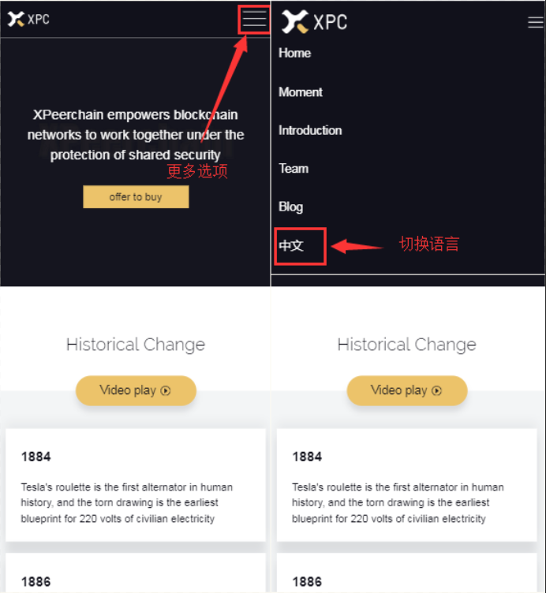
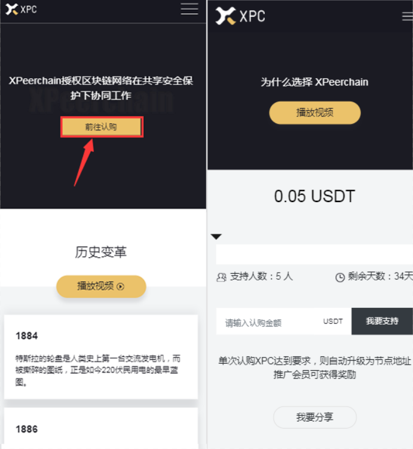
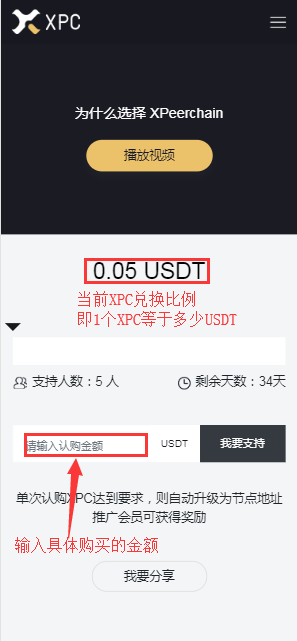
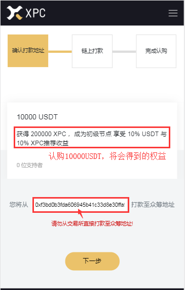
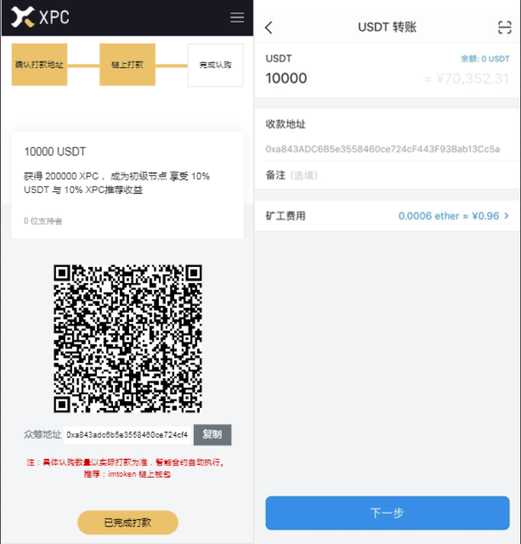
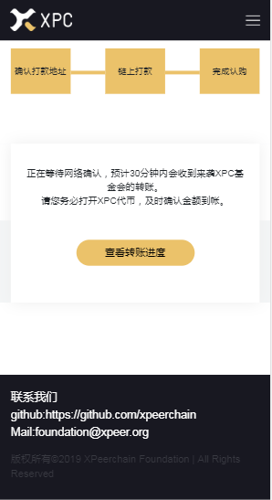

通过浏览器打开 [http://www.xpeer.org/](http://www.xpeer.org/) 进入官方主页。

**1） 语言切换**
官网主页介绍了 `XPeerchain` 项目信息，可以点击右上方角标进行语言切换。

选择简体中文可以更直观的进行认购操作。

**2） 进入认购主页**

点击官网导航栏或者主页的 `前往认购` 进入认购页面

**3） 发起认购**

可以输入自定义的认购金额，点击 `我要支持` 即可进入认购流程

也可以直接选择特定认购金额，以获得最具性价比的认购方案。

> 这里要注意的是，无论是自定义金额还是选择固定的认购方案，权益的分配是根据实际认购金额确定的。

**4）确认打款地址**

输入您参与认购打款的链上 `ETH` 地址。为了保证认购的顺利，务必填写您自己的链上 `ETH` 地址。

建议使用 [imtoken](https://token.im/download) 生成自己的链上 `ETH` 地址。如果还没有 `USDT` 的话也可以通过 [OTCBTC](https://zhuanlan.zhihu.com/p/73078067) 进行购买。

**5）发起链上转账**

复制众筹地址，通过链上钱包向众筹地址转入预先选择的认购金额（USDT）。

也可以通过 imtoken 钱包的扫一扫按钮，扫描界面上的二维码进行支付。
转账完成后，点击`已完成打款`即可等待XPC的到账。

**6）确认 XPC 到账**

通过以太坊浏览器，查看XPC的到账情况。

