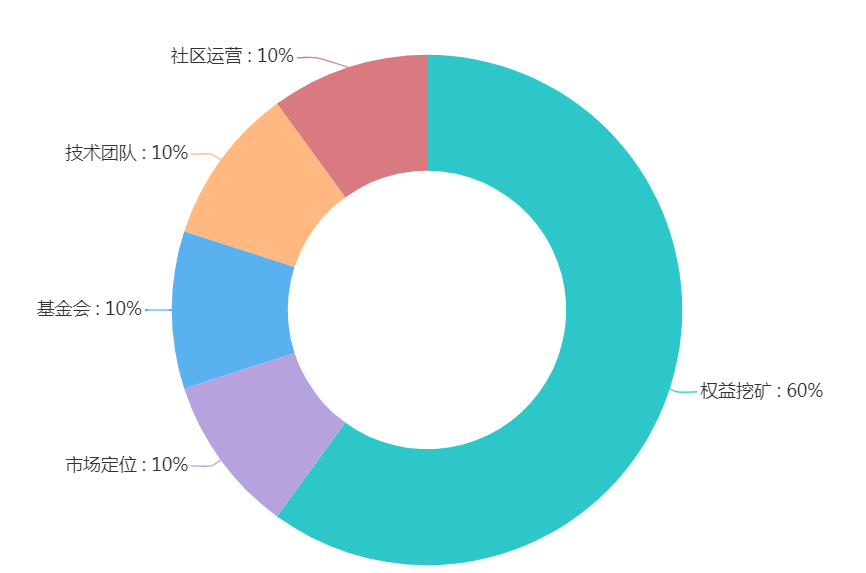

## XPeerchain 文档
## 点点链简介
    一直以来传统的数字货币都存在着交易量和币值稳定的瓶颈问题，往往这些困扰的形成都是因为发行方或者持币大户因一己私利暗箱操作所致。
    为了遏制币圈的各种现状和突破僵局，同时秉持着持币者皆是做市商的理念，点点链有信心将XPC打造成为全球首个恒升状态的数字货币。点点链独创的高效交易解封法将把持币者团结起来，让大家跟着定制交易法则一步一步地拉升XPC币值以维持恒升状态。
        
<iframe height=425 width=1200 src='http://player.youku.com/embed/XNDI5NzUxNDY3Ng==' frameborder=0 'allowfullscreen'></iframe>

### 三大亮点

1) 基于区块链DPoS标准技术的XPC不仅仅保留了传统数字货币去中心化的分布式记账方式，还大大的优化了数字货币互转的速度以及提升了持有者的高度隐私安全措施。

2) 360 天高达 30%的权益增值！点点链采用的是权益证明机制，权益证明机制为持币者提供了一个更便捷高效的Staking挖矿方式。

3) 独创的高效解封交易法则将会打造出全球首个能稳定保持恒升状态的数字货币!

### XPC规格

|  名称   | 描述   | 
|:----|:----|
| 货币名称   | XPeerchain   | 
| 货币代号   | XPC   | 
| 共识机制   | 权益证明（PoS） | 
| 总发行量   | 5亿   | 
| 合约系统   | WASM  | 
| 区块时间   | 10秒 | 
| 通货膨胀   | 5% / 年  | 
| 成熟周期   | 1分钟  | 
| 事务速度   | 跨链多链平行百万级事务处理速度 | 

### 市值定位发行阶段

| 分配比例   | 用途   | 
|:----|:----|
| 60% （3亿）   | pos机制导入去中心化智能合约由持币者 staking 挖矿产出，由共识社区自然分配   | 
| 10%（0.5亿）   | 该部分将用于前期市值定位环节，让市场进行活跃认购，开启XPC起航的第一步。 由推荐人进行社区 ICO 2100万 天使轮：0.05  USDT     100万XPC 基石轮：0.10  USDT     500万XPC A     轮：0.15  USDT     600万XPC B     轮：0.20  USDT     900万XPC 剩余部分将通过全球路演进行社区公募 社区公募：1 USDT  为期15天   | 
| 30%（1.5 亿）   | 1.5亿枚将用于订购有潜力的推广社区，以及日后点点链发展稳固的资金池 10%基金会、10%技术团队、10%用于并购活跃推广社群和发行方维持运作费用   | 

### 附注资料

XPC官网：[http://xpeer.org](http://xpeer.org)

白皮书下载：[https://github.com/xpeerchain/QA/raw/master/zh/assets/pdf/XPeerchain%20TechnicalWhitePaper.pdf](https://github.com/xpeerchain/QA/raw/master/zh/assets/pdf/XPeerchain%20TechnicalWhitePaper.pdf)

白皮书阅读：[http://qa-zh.xpeer.org/technical-white-paper/](http://qa-zh.xpeer.org/technical-white-paper/)

XPC认购主页：[http://www.xpeer.org/portal/index/index](http://www.xpeer.org/portal/index/index)

