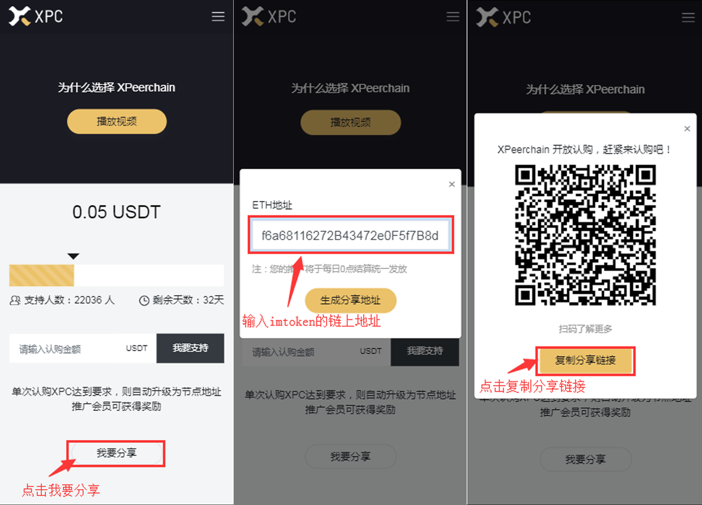

## 获取推广链接

1. 进入[认购页面](http://www.xpeer.org/portal/index/index) 

您将会得到如下的分享链接：http://www.xpeer.org?invite_address=0x0FC6ed389E0C1df6a68116272B43472e0F5f7B8d

您的朋友通过该链接进入认购，认购成功后次日根据您的权益进行推广奖励的结算。

## 推广规则

成为推广人必须要满足以下先决条件：

1. 推广人地址是会员或节点地址

2. 推广人参与过认购，且获得认购的推广分成权益。

3. 被推广的会员的地址没有发起过认购行为。

4. 推广收益可以累加，累加收益价值大于 100USDT 将会在次日进行结算

## 关于分成与结算

1.系统将根据推广的关系，于新加坡时间 00:00 进行推广收益结算，所有的收益将根据推广人地址结算到链上。

2. 为避免小额分成造成的浪费矿工费问题，每日仅对累计收益满100USDT的推广地址进行结算。

## 常见问题

1. 如何查看我的推广收益

    可以通过 imtoken 等去中心化链上钱包查看收益分成

1. 为什么我推广会员，却没有收到分成。

    首先确定您的分成是否大于 100USDT，系统每日仅结算推广收益大于100USDT的推广地址。
    
