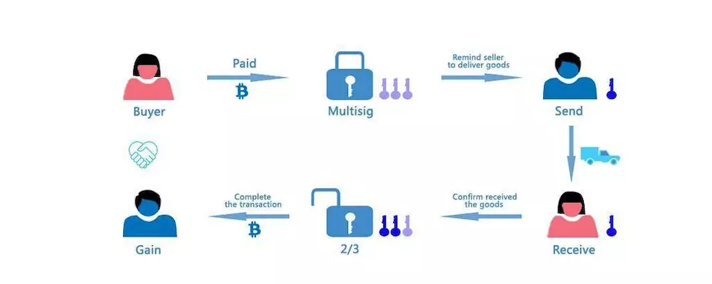

## 一、前言

### 1.背景

在我们对中心化服务的日常使用中，手续费、信息泄露、隐私侵犯、欺诈、审查监控都是常见问题。自2008年比特币概念问世以来，众多区块链应用诞生，开发者们一直试图用区块链技术来解决中心化所带来的以上种种问题[15]。
然而，这些尝试或是过于局限于特定领域，或是受困于交易处理速度，罕有成功。由于灵活度和计算能力的限制，几乎不可能将Facebook、亚马逊这类复杂应用建在区块链之上，更不必提像数字资产交换之类对交易实效性要求更高的应用。
扩容问题来自于现有区块链的底层设计，其中可以被大致分为共识机制和区块链架构。大多数现有区块链在扩容时面临以下两个挑战。

1）每个全节点必须存储整个账本以便参与交易的验证; 

2）网络中的每个参与节点都有义务处理每笔交易。

由于在此种设定下所有的节点，在本质上都进行着相同的处理和运算，整个区块链网络的运行处理速度受限于单个节点的处理速度。此外，随着时间的推移，存储所有区块链上的信息所需的空间也将越来越大，这使得作为全节点参与进来的门槛增大，无论是在存储空间、网络速度、还是计算能力上。日益增长的挖矿成本会不可避免的使得挖矿被掌握在少数节点手中，再次将我们带回了中心化问题。
XPeerchain 旨在填补这一空白。在我们的构想中，XPeerchain 是下一代区块链技术，为服务导向的生态系统提供底层基础建设。XPeerchain 平台不仅为用户提供了一种完全去中心化的方式来交换在线服务和数字商品，而且还使开发者能够部署面向大量用户群体的大型去中心化应用。通过一系列突破性创新，如高效分布式分片（“EDS”）和置信度优先（“Believable-first”）原则，能够在保证安全性的同时极大地提高系统吞吐量。
基于分布式系统中的Sharding（分片）的设计概念开发了EDS。分片这一概念在分布式系统和数据库中被广泛采用，以支持并行交易处理。受计算机科学中经典的“分而治之”原则的启发，EDS将整个 XPeerchain 网络划分为若干称为 Shard（分片） 的子空间。我们可以将每个分片视为并行运行其自己的共识协议的微型网络。与传统区块链技术让整个网络共同验证同一组交易不同，EDS 机制下每个子网络分片将自行组成共识组并同时进行交易验证。因此，即使网络规模和交易数量增长迅速，系统的吞吐量也可以显着提高。而且，为了确保网络的均匀分割，我们开发了一个具有高偏差抗性的分布式随机性生成协议，以便在分片过程中引入无偏且透明的随机性。
除了EDS外，XPeerchain 还包含其他许多创新的技术，以支持高性能和灵活性的大规模 DApp 的部署。它允许开发人员开发多种产品：从传统的、具有垄断性质在线服务提供商的替代品到之前认为不可能的全新商业模式。

### 2.通证（Token）经济到来

到 2019 年二月，区块链技术问世已逾十年。尽管其在此期间不断演变，一 个核心问题仍然存在：区块链技术是否真的是一种革新从而为全球经济创造了价值？
让我们看看目前的数据，区块链管理的资产（称为“链上资产”）基本上是 各种代币或数字货币，总市值大约 1500 亿美金。这些链上资产普遍具有高波动 性和强投机性的特点，难以造福世界经济。实际上，从中本聪开始，人们一直想让这些代币成为一种支付货币，但到目前为止，它们主要作为数字货币使用，并没有发挥传统货币的作用。数字货币与其说是指它们发挥货币的功能，不如说只是一个符号。
一方面，发行货币是一种政治实现，货币权力必须属于国家。因此，加密货币很难取代法定货币。没有国家的授权和支持，所谓“数字货币”只是一种理想 主义的追求。
另一方面，大多数全球主流资产（有形和无形）并不在区块链上（称为“链外”），区块链与链外资产之间的互动有限。
那么，通证只能是数字货币吗？当然不是！通证的基本含义是“符号，象征”， 但它更应该被视为凭证而不是数字货币。这些凭证可以代表各种权利和利益，包 括购物积分、优惠券、身份证、文凭、房地产、通行证、活动门票和各种权利和 利益证明。回顾历史，权益证明是人类社会各文明的重要组成部分。账目、所有 权、资格、证明等都是权益的代表。正如尤瓦尔·赫拉利在《人类简史》中所说， “正是这些‘虚构的事实’才是智者脱颖而出和建设人类文明的核心原因。”如 果这些权益证明都是以数字、电子和密码学保护来验证其真实性和完整性的，那 么人类文明将会有革命性的革新。我们称其为通证经济（Token Economy）。
在区块链上运行通证提供了坚实的信任基础和可追溯性，这是任何传统中心 化基础设施所做不到的。因此，如果通证是通证经济的前端经济单元，那么区块 链就是通证经济的后端技术，二者是整体联系、相互依存的。

无可否认的是，当 XPeerchain 网络的规模相对较小时，运行此类服务可能会相当昂贵。但是，随着网络中节点和资源数量的增加，运行这种大规模DApps的成本将会大大降低。此外，XPeerchain 还提供了还有许多好处，包括：避免网络攻击，高级别数据安全以及不可变属性。
在开发 XPeerchain 区块链的过程中，我们彻底研究了所有当前可用的区块链解决方案，以便从以前的尝试中学习。

XPeerchain 是独立于 Peercoin 的区块链网络，并将成为 Peercoin 的竞争对手。这次发布最早于2019年6月宣布，并由长期支持 Peercoin 的 Scoot Nadal 牵头。Nadal 在发布会说道，他将利用 XPeerchain 建立更符合时代发展的区块链网络，深入优化 PoS 权益证明，构建跨链、智能合约的区块链网络模型。任何人都可以通过 XPeerchain 轻松的发布专属的区块链网络，这个网络将和 XPeerchain 拥有一样的机制，并且可以跟 XPeerchain 的其它平行链进行价值传递。

## 二、相关研究

### 1.比特币和工作量证明（PoW）

中本聪（Satoshi Nakamoto）设计了比特币以解决在无需许可的环境中建立共识的问题，例如任何节点都可以自由地加入和离开网络，而无需系统对共识节点拥有先验知识。在比特币网络中，区块链通过向服务器，就是我们所常说的矿工，提供经济激励来加大分布式系统的规模，而不需要人为干预。比特币网络中的矿工通过计算具有特定难度级别的部分哈希碰撞来形成共识。具有最大累积难度的链将被其他节点认可为共识结果。该解决方案被命名为工作量证明（PoW），实质上是让网络中的所有节点贡献其计算能力以获得激励，从而确定整个系统的交易排序。 PoW的好处是它有能力在无需许可的情况下防御女巫攻击[15]。尽管比特币在规模和安全性方面有一定的优势，但比特币仍有存在一些主要缺点：

1）与其他现代加密货币不同，确认交易需要一个多小时; 

2）很难在比特币网络上开发各种应用程序; 

3）共识机制浪费太多资源，根据研究表明比特币网络每天电费超过200万美元。

更重要的是，早期的研究表明，比特币同类型的区块链必须有足够大的时间间隔来保证安全[16] [17]。因此，比特币不会成为当前中央系统支持日常应用程序和大额交易量的良好替代品。

### 2.权益证明PoS

权益证明的概念初次在一个线上区块链论坛中提出，并被 Peercoin 所采用。 PoS本质上是每一单位的权益持有者有一票投票权，因此对于每个验证者而言，拥有更多权益将拥有更高的投票权。因此，验证人没有经济动机来损害整个区块链网络。对于攻击者来说，攻击的代价是巨大的，因为他们必须拥有大部分权益。在早期的开发中，研究这已经发现权益证明共识机制易受“无利害关系（Nothing-at-Stake）”攻击的影响。由于网络中的服务器/节点在投票验证区块时没有任何的激励/惩罚措施，因此为了获得利益最大化，节点将同时对多个区块进行投票，而没有动力去达成收敛的共识，导致区块链安全性遭到破坏。在后来的一些研究中，slasher算法解决了这个问题，它对违规节点实施了惩罚。许多其他项目也被归类为权益证明的应用。尽管PoS实现了复制状态机协议的活跃性，但它仍然面临中心化和安全问题等挑战。例如，拥有更多代币的验证者将更有可能打包新区块并被奖励更多代币，从而导致潜在的中心化问题。此外，先前的研究结果表明，只有在代币交易不频繁的情况下，权益证明共识协议才能是一个可证实的安全的且配置强大的一致性协议，这可能意味着，为了安全性，权益证明共识协议会存在一个吞吐量上限。
### 3.状态机复制

简而言之，区块链技术是一种状态机复制协议。每种状态机复制协议必须满足两个重要的属性：

1. *安全性*，即网络中的所有服务器具有相同的交易记录;

2. *活跃度*，即客户的交易被快速提交并记录在日志中。

实现状态机复制有两种本质上截然不同的方式：经典式共识和区块链式共识[18]。经典共识通常采用类似Paxos的共识算法，并在对共识节点有先验知识的权限环境下使用。像亚马逊这样的软件公司的服务器就是一个很好的例子，他们的服务器集体使用经典的方式来复制和存储信息，而经典算法建立了基本原则以形成数据排序的共识。
## 三、区块链架构 
XPeerchain 区块链的架构与现有的众所周知的区块链相似，比如比特币和以太坊，节点通过 Gossip 协议传播数据。系统将数据和状态切分成不同分片。系统中每一个节点都将被包含在一个分片中。未使用的交易（UTXO）存储在相应分片中节点的内存中。这产生了几个新的挑战。

* 如何将系统分成分片。

* 如何在每个分片中达成一致。

* 如何执行分片间交易。

为了公平和安全的解决上述问题，我们必须执行许多随机操作。例如，将节点分配到分片中，选择每个分片中的领头节点。因此，我们必须首先设计一个不可伪造的，无偏的（均匀随机）分布式随机数生成协议。利用随机数生成协议，上述问题可以逐个解决。
在本文的其余部分，我们将介绍用于解决这些挑战的技术和方法。

* 在第4章中，我们将详细探讨 *分布式随机性协议（Distributed Randomness Protocol，DRP）* ，当恶意节点的比例低于某个预定的阈值时，该协议是不可伪造且无偏见的。DRP生成的随机数用于将系统分成分片，将节点分配给不同的分片，并选择每个分片中的领头节点。

* 在第5章中，我们展示了 *Atomix* --一种新颖的两步分片间原子提交协议，保证拜占庭设置中的交易原子性。

* 在第6章中，我们介绍了 *微型块（MSB）* - 一种新颖的机制，可以最大限度地减少验证节点的存储和进入成本。

* 在第7章中，我们介绍 *置信度证明（PoB）* - 一种开创性的拜占庭式共识协议，采用置信度优先原则，保证系统的安全性和活跃性，同时大大提高了分片中的交易吞吐量的共识机制。

## 四、分布式随机性协议

传统的生成随机性的方法，如工作量证明机制[13]或可信任的信标[6]具有计算浪费和中心化问题。使用密码学工具来生成分布式随机数不仅可以节省资源，而且可以数据保证安全。
用于XPeerchain区块链中的节点分片分配和领头节点选举时需要使用随机数来保障公平。目前有多种算法可以在分布式系统中生成随机数。在这里我们介绍一个最适合XPeerchain区块链场景中需求的算法。在XPeerchain区块链中，分布式随机数的产生器具有以下要求：

1. 必须以一定比例抵制不诚实的参与者（包括客户端和服务器）。详细来说，当不诚实的参与者比例低于一定数量时，系统能够继续运行，并且不会发生任何不良情况。

2. 除了可忽略的概率外，最终的随机数必须是不可伪造和无偏的（一致随机的）。

3. 不诚实的参与者不能多次尝试产生有利于自己的随机数，即使在多个不诚实的参与者串通的情况下也无法做到。

4. 第三方能够验证输出结果是否为诚实的运行协议所产生（即验证它是否满足上述所有要求）。

为了达到这些要求，我们提出使用称为分布式随机协议（DRP）[24]的客户端 - 服务器协议，其中客户端通过非交互式零知识证明（NIZK）和可公开验证的秘密共享（PVSS）与一组服务器进行通信而产生一个不可伪造的，均匀分布中的随机值。在协议的运行时，在协议完成并显示最终的随机数之前，协议中的任何参与者都无法获知有关最终输出的任何信息，从而确保不诚实的客户端无法尝试多次生成随机数字而选择更有利的随机数。
协议由两个阶段组成 - 随机数的生成和随机数的验证。简单来说，它的工作原理如下：最初，客户端通过向所有服务器广播包括随机生成的均衡分组的消息来启动协议运行。在第一阶段，每台服务器都会生成一个随机输入值，并仅使用PVSS为同一组的其他成员创建“共享投票”。在收到来自所有服务器的NIZK [25]证明的加密共享投票后或服务器超时后，客户端会从每个组中选择一部分服务器的输入内容。这允许客户端固定每个组的密钥和协议的输出结果。在第二阶段，一旦客户端收到全局对于输入内容的集体签名（CoSi），服务器就会解密并将其共享投票发送给客户端[25]。然后，客户端将恢复的组的密匙合并起来以显示最终的随机输出。

## 五、分片交易

支持分片间交易的机制在我们的系统中至关重要，因为交易很可能发生在多个分片上。我们引入拜占庭分片原子提交（Atomix）协议来确保分片之间的原子性。该协议可防止双重支出并保持交易的一致性。我们的设计是Omniledger算法的变体。 [8]
首先在UTXO状态模型中提出Atomix。以前的文献和研究已经证明，如果支持UTXO模型，Atomix可以确保我们的分片间交易机制也支持智合约同[27]。
简而言之，当一个交易同时经过a节点的A分片以及b节点的B分片，该算法执行以下操作：

1. 在分片A中创建交易TX，并让所有节点验证此交易。

2. 如果交易TX由分片A中的所有节点批准，则该交易会被记录在A的区块链中。与此同时，客户将八卦一份接受证明以认证交易，将a的资金锁定在一个UTXO上，并将其发送给B.

* 如果交易TX被A中的节点拒绝，则资金返回到a。

1. A的区块链将交易TX提交给B的区块链，并在要求接收者分片中的节点验证交易TX。

* 如果交易TX被B中的节点拒绝，则资金返回到a。

1. 如果交易TX被B的区块链中的所有节点批准，则该资金被释放给b。

* 如果TX被所有节点拒绝，该资金会被退回到a。

## 六、区块链存储剪枝算法

当前区块链正面临的另一个问题是区块链存储规模的迅速扩大[8]，这为新加入的验证人带来了繁重的工作负载。区块链一直在遵循相同的模式来存储历史数据。但是，对于高吞吐量区块链系统来说，这是一个至关重要的问题，因为存储需求将会飞速增长。为了尽量减少验证人的存储和冷启动成本，我们使用区块链存储剪枝算法来压缩分片区块链的完整状态。 我们使用基于State Block[8]的微型状态块（MSB）。 我们在下面介绍MSB生成协议。  

## 七、共识机制

### 1.代币和动机

在 XPeerchain 系统中，XPeerchain 代币与其他区块链系统中的代币一样，用于所有交易的价值载体以及支付使用资源的佣金费用。更重要的是，XPeerchain 代币也可被用作计算用户的可信度分数的一个变量。所有XPeerchain代币都将在创世块中生成。在XPeerchain 生态系统中，XPeerchain 代币可用于：

* 支付：支付商家或其他社区成员提供的服务和商品。

* 佣金：支付给节点作为运行智能合约，处理消息和交易，使用一般生态系统共享的资源（包括但不限于存储空间，计算能力等）的补偿。佣金可以激励验证者并防止恶意用户通过过度部署智能合约来损害社区的利益。

* 可信度：XPeerchain 代币将被用于计算用户的可信度（在下一节中进行解释）。

此外，作为XPeerchain 生态系统的一员，每个用户都可以通过验证交易和贡献资源（例如运行智能合约，提供存储空间等）来获取XPeerchain 代币。
正如前面部分提到的，传统的权益证明共识机制面临的一个主要挑战是集中化趋势。为了减轻这种风险，我们引入了Servi作为用户对社区贡献的衡量标准，并鼓励成员为XPeerchain 区块链的持续发展做出贡献。它具有以下属性：

* 不可交易：由于Servi不作为交换媒介，Servi不能以任何方式进行交易或交换。

* 自毁：区块验证后，系统会自动清除验证者所拥有的Servi余额，使可信度高的节点轮流验证区块，从而保证公平的区块生成过程。

* 自行发放：在提供社区服务，评估另一方提供的服务或做出其他特殊贡献等一定的贡献后，Servi将自动生成并存入用户账户。

### 2.可信度证明研究

根据不一样的分片大小，区块链系统会在安全性和吞吐量之间具有天生的折衷。一个拥有大量小分片（包含节点数量小）的系统可以提供更好的性能，但对恶意节点的防御较弱，反之亦然。为了同时保证安全性和提高吞吐量，我们为 XPeerchain 区块链提出了一个创新的可信度证明（PoB）共识协议。 PoB保证节点运行恶意行为的可能性微乎其微，同时通过大小为一的分片显著提高交易吞吐量。
可信度证明共识协议使用分片间可信度优先（Believable-First）方法。该协议将所有验证者分为两组，一个高可信分组和一个普通分组。高可信验证人在第一阶段快速处理交易。之后，在第二阶段，普通验证人对这些交易进行抽样和验证，以提供最终结果并确保可验证性。节点被选入高可信分组的机会由可信度得分确定，可信度得分由多个因素计算得到，例如：代币余额、对社区的贡献度、网络行为等。一个具有较高可信度分数的个体更有可能被选入高可信分组。可信验证人遵循程序来决定认证的交易及其顺序，并按顺序处理。可信的验证者也可以组成更小的组 - 每组一个验证者。交易将随机被分配到这些可信的验证者中。因此，它们以极低的延迟产生更小的区块。
但是，在此种情况下，由于只有一个节点正在执行验证，因此可能会有安全隐患。因此，一些恶意交易可能是由恶意的验证者犯下。为了解决这个安全问题，我们指定一个抽样概率p，即正常验证者将对交易进行抽样并检测其不一致性。如果验证人被检测为不当行为，将会丢失系统中的所有代币和声誉，而受到欺诈的用户将获得赔偿。可信度优先方法使得处理交易非常快速，因为只有一个（可信的）验证者正在进行验证，并且在正确的参数设置下，不端行为发生的可能性非常低。
在 XPeerchain 系统中，分片策略文件分别指定高可信和普通分组的大小以及采样概率p。每个epoch开始时，所有的验证者都将通过分布式随机生成协议被分配到不同的分片。它们的状态将从相应分片的最后一个微状态块（MSB）中引导。根据可信度分数，验证者将被分配到高可信组（包含节点数较少）或分片内的正常组（包含节点数较多）。
在第一阶段，由高可信分组处理的交易产生的被验证过的区块。这些区块作为同时运行的普通分组的抽样重新验证输入。普通联盟也结合了来自多个处理组的输入。这可以最大化系统的吞吐量。如果交易成功进行验证，它们将被包含在已完成的块中，添加到分片的区块链中，并最终包含在MSB中。然而，当普通分组检测到任何不一致时，相应的验证交易将被排除在区块链之外，并且签名无效区块的验证者将被检测到并被追究责任。我们将惩罚方案设计得非常苛刻，以便验证人在任何情况下都不会有任何行为不端的动机。如果验证者被检测为行为不当，该验证者将丢失系统中的所有代币和信誉，并且将重新检查之前验证过的所有交易。考虑到极小的恶意激励以及可以量化的验证系统安全性的信心，客户可以在随时实现实时处理。
普通分组的运行基于ByzCoin [7]的拜占庭共识策略，因为它可以有效扩展到成千上万的共识团队成员。 ByzCoin使用集合签名（CoSi）[25]，一种使用多重签名的可扩展密码原语[20]来制作传统的共识算法，如PBFT [4]。 ByzCoin使用组播树来分发区块以提高性能，并回退到星型拓扑以实现容错。它可以确保在即使分片中有一些恶意节点的情况下，分片的所有诚实成员都能够达成特定的通用操作序列，同时保证了系统安全性和活跃性。
为了确保稳定性，我们在可信度有限协议中使用备选方案。当一个分片没有足够的可信验证者来组建高可信分组时，不管是由于暂时停工或者处于生态系统的冷启动阶段，两部验证委员会会变成单步分组，即所有交易均由普通分组直接根据PBFT共识协议处理。

### 3.共识算法

XPeerchain 使用 BFT-DPOS 作为其共识算法。DPOS 已经被证明能够满足区块链应用的要求。在这一算法下，所有持有 XPC 的人可以通过连续的投票系统来选择生产区块的节点。任何人都可以参与区块生产，只要他能够说服通证持有者投票给他。
XPeerchain 每 0.5s 生成一个区块，并且同一时间只有一个生产者被授权产生区块。如果该区块没有按时产生，则跳过这一时间段的块。当一个或多个区块被跳过时，区块链上可能存在 0.5 秒或更多秒的空隙。
XPeerchain 公链的出块节点是动态的。在最初我们设定为 15 个出块节点。 之后这个数字将由去中心化链上治理委员会决定。为了方便起见，我们在本白皮书中假定使用 15 个出块节点。
在 XPeerchain 系统中，每 180 个块是一个轮次（每个块生成 12 个，有 15 个出块节点）。在每一轮开始时，15 个独特的出块节点会被 XPC 通证持有者投票选出。这些被选中的出块节点按照 11 个或更多出块节点同意的顺序进行出块。
如果一个出块节点错过了一个块，并且在过去的 24 小时内没有生产任何块， 它会被移出生产者直到它向区块链表达再次出块的意愿。通过最小化不可靠出块节点漏块的数量来保证网络运行的流畅性。
拜占庭容错算法允许所有的出块节点来签署所有的块，只要没有出块节点用 同一个时间戳或块高度来签署两个不同的块。一旦有超过 11 个出块节点签署了 一个块，这个块就被验证通过并且不可逆转。任何拜占庭出块节点签署了两个相 同时间戳的块或者相同高度的块都将成为他们作恶的密码学证据。

### 4.分红设计

分红机制是 XPeerchain 中升级的 PoS 新机制。这是一个强大、灵活、方便的机制，可以与现有的功能相结合。它的主要目的是根据一套规则将利润分配给利益相关者或股东。现在根据盈利方式的不同支持两种类型的分红：被动分红和主动分红。
被动分红是指，DApp可用根据社区运营状况通过合约对特定用户行为进行空投分红。
主动分红是指，XPC持有者可以通过投票的方式参与到分红模式中，节点的产块收益根据系统分红规则、XPC投票数量、XPC投票占比参数进行计算，将部分收益分发给投票人。

## 八、智能合约

智能合约是一套以数字形式定义的承诺 (promises)，包括合约参与方可以在上面执行这些承诺的协议。 在物理上，智能合约的载体是计算机可识别并运行的计算机代码。比特币脚本语言是一种命令式的、基于栈的编程语言，由于它是非图灵完备的，所以应用上有一定的局限性。以太坊是全世界第一个实现图灵完备的智能合约的区块链系统，编程语言是 Solidity、Serpent，使得应用开发者们可以高效快速地开发各式 各样的应用程序。智能合约代码发布到区块链上之后，无需中介的参与，在区块链上自动执行。 XPeerchain 中的智能合约编程语言，会使用全球最火热的 Java 作为合约语言，后续我们将推出各种编程语言的支持，使得开发者可以用自己喜欢的高级语言编程，例如 Python、Go、JavaScript、Scala 等。
XPeerchain 将支持图灵完备的智能合约，使区块链网络能够运行更丰富，更具场景化的生态应用；

## 九、多重签名

XPeerchain的授权操作主要包括多重签名、权重计算、阈值设置等。由于 每个通证是相互独立的，通证的转移可以并行的执行。此外，由于每个组的许可彼此独立，也可以在不同的组之间并行执行发行和管理的操作。

## 十、参考文献

[1]	Iddo Bentov, Ariel Gabizon, and Alex Mizrahi. 2016. Cryptocurrencies Without Proof of Work. In Lecture Notes in Computer Science. 142–157.

[2]	Iddo Bentov, Charles Lee, Alex Mizrahi, and Meni Rosenfeld. 2014. Proof of Activity. ACM SIGMETRICS Performance Evaluation Review 42, 3 (2014), 34–37.

[3]	Vitalik Buterin. 2014. Slasher: a punitive proof of stake algorithm. Retrieved January 9, 2018 from https://blog.ethereum.org/2014/01/15/slasher-a-punitive-proof-of-stake-algorithm/

[4]	Miguel Oom Temudo de Castro. 2000. Practical Byzantine Fault Tolerance.

[5]	Nxt Community. Nxt Whitepaper. Retrieved January 9, 2018 from https://bravenewcoin.com/assets/Whitepapers/NxtWhitepaper-v122-rev4.pdf

[6]	George Danezis and Sarah Meiklejohn. 2016. Centrally Banked Cryptocurrencies. In Proceedings 2016 Network and Distributed System Security Symposium. DOI:https://doi.org/10.14722/ndss.2016.23187

[7]	E. Kokoris-Kogias, P. Jovanovic, N. Gailly, I. Khoffi, L. Gasser, and B. Ford. 2016. Enhancing Bitcoin Security and Performance with Strong Consistency via Collective Signing. In 25th USENIX Conference on Security Symposium.

[8]	Eleftherios Kokoris-Kogias, Philipp Jovanovic, Linus Gasser†, Nicolas Gailly, Ewa Syta, Bryan Ford. 2017. OmniLedger: A Secure, Scale-Out, Decentralized Ledger via Sharding.

[9]	Yossi Gilad, Rotem Hemo, Silvio Micali, Georgios Vlachos, and Nickolai Zeldovich. 2017. Algorand: Scaling Byzantine Agreements for Cryptocurrencies. In Proceedings of the 26th Symposium on Operating Systems Principles - SOSP ’17. DOI:https://doi.org/10.1145/3132747.3132757

[10]	G Maxwell And. 2015. On Stake and Consensus. Retrieved January 9, 2018 from https://download.wpsoftware.net/bitcoin/pos.pdf

[11]	Ian Grigg. EOS - An Introduction. eos.io. Retrieved from https://eos.io/documents/EOS_An_Introduction.pdf

[12]	J. Kwon. 2014. Tendermint: Consensus without mining. Retrieved January 9, 2018 from http://tendermint.com/docs/tendermint.pdf

[13]	Loi Luu, Viswesh Narayanan, Chaodong Zheng, Kunal Baweja, Seth Gilbert, and Prateek Saxena. 2016. A Secure Sharding Protocol For Open Blockchains. In Proceedings of the 2016 ACM SIGSAC Conference on Computer and Communications Security - CCS’16. DOI:https://doi.org/10.1145/2976749.2978389

[14]	Ralph C. Merkle. A Certified Digital Signature. In Lecture Notes in Computer Science. 218–238.

[15]	Satoshi Nakamoto. Bitcoin: A Peer-to-Peer Electronic Cash System. bitcoin.org. Retrieved from https://bitcoin.org/bitcoin.pdf

[16]	Rafael Pass, Lior Seeman, and Abhi Shelat. 2017. Analysis of the Blockchain Protocol in Asynchronous Networks. In Lecture Notes in Computer Science. 643–673.

[17]	Rafael Pass and Elaine Shi. 2017. The Sleepy Model of Consensus. In Lecture Notes in Computer Science. 380–409.

[18]	Phil Daian and Rafael Pass and Elaine Shi. 2016. Snow White: Provably Secure Proofs of Stake. (2016).

[19]	Phil Daian Rafael Pass. Snow White: Robustly Reconfigurable Consensus and Applications to Provably Secure Proofs of Stake.

[20]	C. P. Schnorr. 1991. Efficient signature generation by smart cards. J. Cryptology 4, 3 (1991). DOI:https://doi.org/10.1007/bf00196725

[21]	Jagdeep Sidhu. 2017. Syscoin: A Peer-to-Peer Electronic Cash System with Blockchain-Based Services for E-Business. In 2017 26th International Conference on Computer Communication and Networks (ICCCN). DOI:https://doi.org/10.1109/icccn.2017.8038518

[22]	Sunny King And. Ppcoin: Peer-to-peer crypto-currency with proof-of-stake. Retrieved 2012 from https://peercoin.net/assets/paper/peercoin-paper.pdf

[23]	Scott Nadal Sunny King. 2012. Peercoin. Retrieved January 9, 2018 from https://peercoin.net/assets/paper/peercoin-paper.pdf

[24]	Ewa Syta, Philipp Jovanovic, Eleftherios Kokoris Kogias, Nicolas Gailly, Linus Gasser, Ismail Khoffi, Michael J. Fischer, and Bryan Ford. 2017. Scalable Bias-Resistant Distributed Randomness. In 2017 IEEE Symposium on Security and Privacy (SP). DOI:https://doi.org/10.1109/sp.2017.45

[25]	Ewa Syta, Iulia Tamas, Dylan Visher, David Isaac Wolinsky, Philipp Jovanovic, Linus Gasser, Nicolas Gailly, Ismail Khoffi, and Bryan Ford. 2016. Keeping Authorities “Honest or Bust” with Decentralized Witness Cosigning. In 2016 IEEE Symposium on Security and Privacy (SP). DOI:https://doi.org/10.1109/sp.2016.38

[26]	V Buterin And. 2015. Casper. Retrieved January 9, 2018 from https://blog.ethereum.org/2015/08/01/ introducing-casper-friendly-ghost/

[27]	G. Wood. 2014. Ethereum: A Secure Decentralised Generalised Transaction Ledger. Ethereum Project Yellow Paper. (2014).

[28]	Gavin Wood. 2018. ETHEREUM: A SECURE DECENTRALISED GENERALISED TRANSACTION LEDGER. ethereum.github.io/yellowpaper. Retrieved from https://ethereum.github.io/yellowpaper/paper.pdf

[29]	2017. Steem: An incentivized, blockchain-based, public content platform. steem.io. Retrieved from https://steem.io/SteemWhitePaper.pdf

[30]	Whitepapers. bitshares.org. Retrieved from http://docs.bitshares.org/bitshares/papers/

[31]	Proof of stake instead of proof of work. Retrieved January 9, 2018 from https://bitcointalk.org/index.php?topic=27787.0
